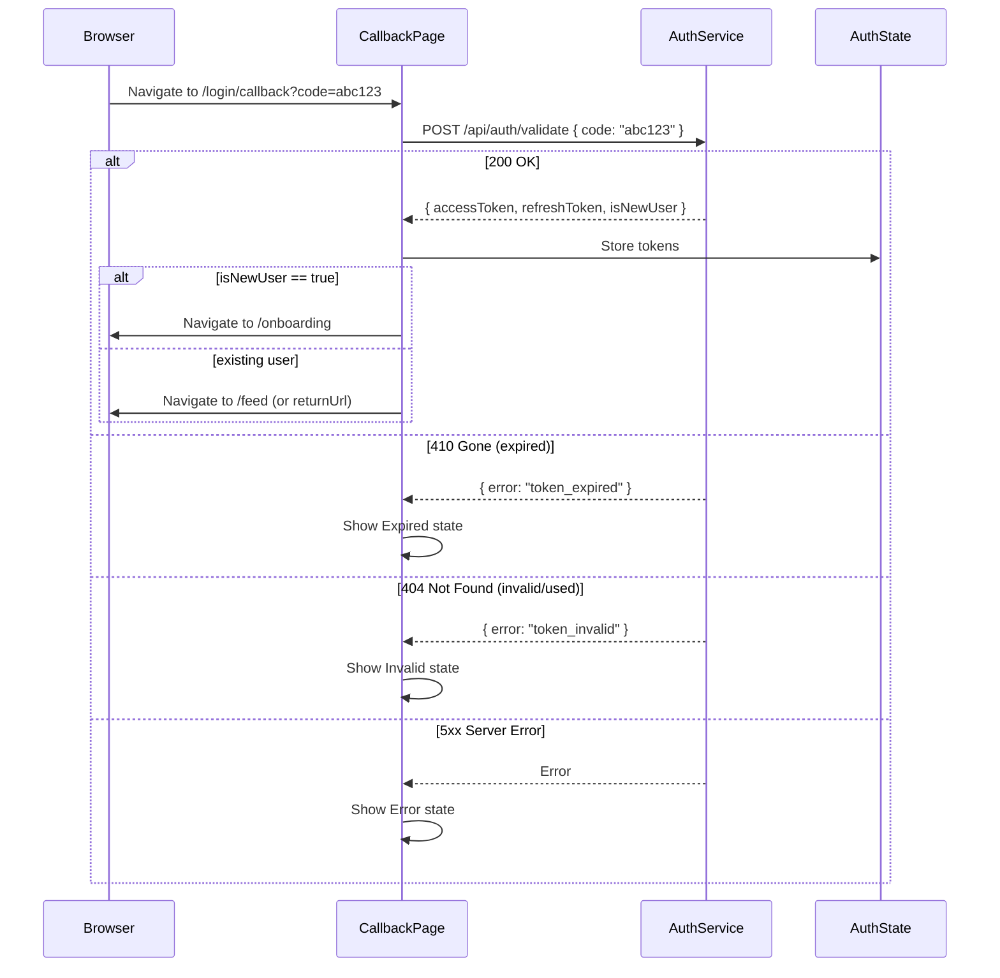
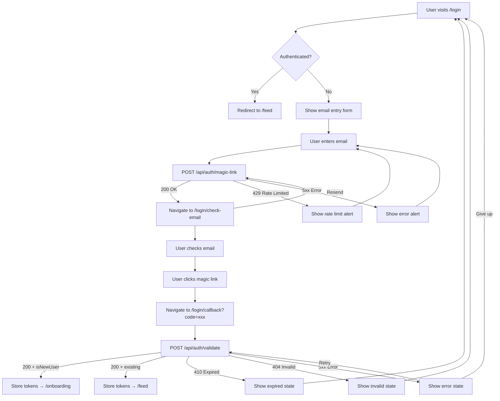

# SNAPP Login Flow Specification (Magic Link)

## Overview

SNAPP uses passwordless magic-link authentication. The user enters their email, receives a link, clicks it, and is authenticated. No passwords are ever stored or transmitted.

---

## Page 1: Email Entry

### Route

**`/login`**

No application shell. Minimal centered layout.

### Layout

```
┌──────────────────────────────────────────────────────────────┐
│                                                              │
│                                                              │
│              ┌──────────────────────────────┐                │
│              │  [SNAPP Logo]                │                │
│              │                              │                │
│              │  Sign in to SNAPP            │                │
│              │  Enter your email and we'll  │                │
│              │  send you a sign-in link.    │                │
│              │                              │                │
│              │  ┌────────────────────────┐  │                │
│              │  │  Email address         │  │                │
│              │  └────────────────────────┘  │                │
│              │                              │                │
│              │  [    Send sign-in link    ] │                │
│              │                              │                │
│              │  No account? We'll create   │                │
│              │  one for you automatically.  │                │
│              └──────────────────────────────┘                │
│                                                              │
│              Secured by PraxisIQ                             │
│                                                              │
└──────────────────────────────────────────────────────────────┘
```

### Component Specification

```razor
@page "/login"
@layout EmptyLayout

<MudContainer MaxWidth="MaxWidth.ExtraSmall" Class="d-flex flex-column align-center justify-center"
              Style="min-height: 100vh;">
    <MudPaper Elevation="2" Class="pa-8" Style="width: 100%; max-width: 420px;">

        <div class="d-flex justify-center mb-6">
            <MudImage Src="/images/snapp-logo.svg" Height="40" />
        </div>

        <MudText Typo="Typo.h5" Align="Align.Center" Class="mb-2">
            Sign in to SNAPP
        </MudText>
        <MudText Typo="Typo.body2" Align="Align.Center" Color="Color.Secondary" Class="mb-6">
            Enter your email and we'll send you a sign-in link.
        </MudText>

        <EditForm Model="loginModel" OnValidSubmit="SendMagicLink">
            <MudTextField @bind-Value="loginModel.Email"
                          Label="Email address"
                          Variant="Variant.Outlined"
                          InputType="InputType.Email"
                          Required="true"
                          RequiredError="Email address is required"
                          Validation="@(new EmailAddressAttribute())"
                          Disabled="@sending"
                          AutoFocus="true"
                          Class="mb-4" />

            <MudButton ButtonType="ButtonType.Submit"
                       Variant="Variant.Filled"
                       Color="Color.Primary"
                       FullWidth="true"
                       Size="Size.Large"
                       Disabled="@sending">
                @if (sending)
                {
                    <MudProgressCircular Size="Size.Small" Indeterminate="true" Class="mr-2" />
                }
                Send sign-in link
            </MudButton>
        </EditForm>

        <MudText Typo="Typo.caption" Align="Align.Center" Color="Color.Secondary" Class="mt-4">
            No account? We'll create one for you automatically.
        </MudText>

    </MudPaper>

    <MudText Typo="Typo.caption" Color="Color.Secondary" Class="mt-4">
        Secured by PraxisIQ
    </MudText>
</MudContainer>
```

### Behavior

| Action | Behavior |
|--------|----------|
| Submit with valid email | POST to `/api/auth/magic-link`. On 200, navigate to `/login/check-email?email={email}`. |
| Submit with invalid email | Show inline validation: "Please enter a valid email address" |
| Submit with empty field | Show inline validation: "Email address is required" |
| Rate limited (429) | Show alert: "Too many requests. Please wait a few minutes and try again." |
| Server error (5xx) | Show alert: "Something went wrong. Please try again." |
| Already authenticated | Redirect to `/feed` immediately on page load. |

---

## Page 2: Check Your Email

### Route

**`/login/check-email?email={email}`**

No application shell.

### Layout

```
┌──────────────────────────────────────────────────────────────┐
│                                                              │
│              ┌──────────────────────────────┐                │
│              │  [SNAPP Logo]                │                │
│              │                              │                │
│              │  ✉  Check your email         │                │
│              │                              │                │
│              │  We sent a sign-in link to   │                │
│              │  j***n@example.com           │                │
│              │                              │                │
│              │  Click the link in your      │                │
│              │  email to sign in. The link  │                │
│              │  expires in 15 minutes.      │                │
│              │                              │                │
│              │  ─────────────────────────── │                │
│              │                              │                │
│              │  Didn't get it?              │                │
│              │  [Resend link]               │                │
│              │                              │                │
│              │  [← Back to sign in]         │                │
│              └──────────────────────────────┘                │
│                                                              │
└──────────────────────────────────────────────────────────────┘
```

### Component Specification

```razor
@page "/login/check-email"
@layout EmptyLayout

<MudContainer MaxWidth="MaxWidth.ExtraSmall" Class="d-flex flex-column align-center justify-center"
              Style="min-height: 100vh;">
    <MudPaper Elevation="2" Class="pa-8 text-center" Style="width: 100%; max-width: 420px;">

        <div class="d-flex justify-center mb-6">
            <MudImage Src="/images/snapp-logo.svg" Height="40" />
        </div>

        <MudIcon Icon="@Icons.Material.Filled.MarkEmailRead"
                 Size="Size.Large" Color="Color.Primary" Class="mb-3" />

        <MudText Typo="Typo.h5" Class="mb-3">
            Check your email
        </MudText>

        <MudText Typo="Typo.body1" Class="mb-1">
            We sent a sign-in link to
        </MudText>
        <MudText Typo="Typo.body1" Style="font-weight: 600;" Class="mb-4">
            @maskedEmail
        </MudText>

        <MudText Typo="Typo.body2" Color="Color.Secondary" Class="mb-6">
            Click the link in your email to sign in. The link expires in 15 minutes.
        </MudText>

        <MudDivider Class="mb-4" />

        <MudText Typo="Typo.body2" Class="mb-2">Didn't get it?</MudText>

        @if (resendCooldown > 0)
        {
            <MudText Typo="Typo.body2" Color="Color.Secondary">
                Resend available in @resendCooldown seconds
            </MudText>
        }
        else if (resent)
        {
            <MudAlert Severity="Severity.Success" Dense="true" Class="mb-3">
                A new link has been sent.
            </MudAlert>
        }
        else
        {
            <MudButton Variant="Variant.Text" Color="Color.Primary"
                       OnClick="ResendLink" Disabled="@resending">
                Resend link
            </MudButton>
        }

        <MudButton Variant="Variant.Text" Color="Color.Default"
                   Href="/login" Class="mt-4"
                   StartIcon="@Icons.Material.Filled.ArrowBack">
            Back to sign in
        </MudButton>

    </MudPaper>
</MudContainer>
```

### Email Masking

Display the email with middle characters masked: `j***n@example.com`. Logic:
- If local part <= 2 chars: show first char + `***`
- If local part > 2 chars: show first char + `***` + last char
- Domain shown in full

### Resend Behavior

| Action | Behavior |
|--------|----------|
| Click "Resend link" | POST to `/api/auth/magic-link` again. On success, show "A new link has been sent." and start 60-second cooldown. |
| During cooldown | Button replaced with "Resend available in {N} seconds" countdown. |
| Rate limited (429) | Show alert: "Too many attempts. Please wait a few minutes." |
| Second resend | Same behavior, cooldown resets to 60s. Max 3 resends. After 3: "Please check your spam folder or try a different email address." |

---

## Page 3: Callback / Validation

### Route

**`/login/callback?code={code}`**

No application shell. User arrives here from clicking the magic link in their email.

### Layout — Loading State

```
┌──────────────────────────────────────────────────────────────┐
│                                                              │
│              ┌──────────────────────────────┐                │
│              │  [SNAPP Logo]                │                │
│              │                              │                │
│              │  ◌  Signing you in...        │                │
│              │                              │                │
│              └──────────────────────────────┘                │
│                                                              │
└──────────────────────────────────────────────────────────────┘
```

### Component Specification

```razor
@page "/login/callback"
@layout EmptyLayout

<MudContainer MaxWidth="MaxWidth.ExtraSmall" Class="d-flex flex-column align-center justify-center"
              Style="min-height: 100vh;">
    <MudPaper Elevation="2" Class="pa-8 text-center" Style="width: 100%; max-width: 420px;">

        <div class="d-flex justify-center mb-6">
            <MudImage Src="/images/snapp-logo.svg" Height="40" />
        </div>

        @if (state == CallbackState.Validating)
        {
            <MudProgressCircular Color="Color.Primary" Indeterminate="true" Class="mb-4" />
            <MudText Typo="Typo.h6">Signing you in...</MudText>
        }
        else if (state == CallbackState.Expired)
        {
            <MudIcon Icon="@Icons.Material.Filled.TimerOff"
                     Size="Size.Large" Color="Color.Warning" Class="mb-3" />
            <MudText Typo="Typo.h5" Class="mb-2">Link expired</MudText>
            <MudText Typo="Typo.body2" Color="Color.Secondary" Class="mb-4">
                Sign-in links are valid for 15 minutes. Request a new one below.
            </MudText>
            <MudButton Variant="Variant.Filled" Color="Color.Primary"
                       Href="/login" FullWidth="true">
                Back to sign in
            </MudButton>
        }
        else if (state == CallbackState.Invalid)
        {
            <MudIcon Icon="@Icons.Material.Filled.ErrorOutline"
                     Size="Size.Large" Color="Color.Error" Class="mb-3" />
            <MudText Typo="Typo.h5" Class="mb-2">Invalid link</MudText>
            <MudText Typo="Typo.body2" Color="Color.Secondary" Class="mb-4">
                This sign-in link is invalid or has already been used.
                Each link can only be used once.
            </MudText>
            <MudButton Variant="Variant.Filled" Color="Color.Primary"
                       Href="/login" FullWidth="true">
                Back to sign in
            </MudButton>
        }
        else if (state == CallbackState.Error)
        {
            <MudIcon Icon="@Icons.Material.Filled.CloudOff"
                     Size="Size.Large" Color="Color.Error" Class="mb-3" />
            <MudText Typo="Typo.h5" Class="mb-2">Something went wrong</MudText>
            <MudText Typo="Typo.body2" Color="Color.Secondary" Class="mb-4">
                We couldn't complete your sign-in. Please try again.
            </MudText>
            <MudButton Variant="Variant.Filled" Color="Color.Primary"
                       OnClick="RetryValidation" Class="mb-2" FullWidth="true">
                Try again
            </MudButton>
            <MudButton Variant="Variant.Text" Color="Color.Default"
                       Href="/login" FullWidth="true">
                Back to sign in
            </MudButton>
        }

    </MudPaper>
</MudContainer>
```

### Validation Flow



### Behavior

| Scenario | Behavior |
|----------|----------|
| Valid code, existing user | Store tokens, redirect to `/feed` (or `returnUrl` query param if present). |
| Valid code, new user | Store tokens, redirect to `/onboarding`. |
| Expired code (410) | Show "Link expired" with timer icon and back-to-login button. |
| Invalid/used code (404) | Show "Invalid link" with error icon and back-to-login button. |
| Server error (5xx) | Show "Something went wrong" with retry button. Retry re-posts the same code. Max 2 retries, then show back-to-login only. |
| No code param | Redirect to `/login` immediately. |
| Already authenticated | Redirect to `/feed` immediately. |

---

## Microcopy Reference

### Email Entry Page

| Element | Text |
|---------|------|
| Page title | "Sign in to SNAPP" |
| Subtitle | "Enter your email and we'll send you a sign-in link." |
| Email label | "Email address" |
| Email required error | "Email address is required" |
| Email format error | "Please enter a valid email address" |
| Submit button | "Send sign-in link" |
| Auto-create note | "No account? We'll create one for you automatically." |
| Rate limit alert | "Too many requests. Please wait a few minutes and try again." |
| Server error alert | "Something went wrong. Please try again." |
| Footer | "Secured by PraxisIQ" |

### Check Email Page

| Element | Text |
|---------|------|
| Page title | "Check your email" |
| Sent message | "We sent a sign-in link to" |
| Expiry note | "Click the link in your email to sign in. The link expires in 15 minutes." |
| Resend prompt | "Didn't get it?" |
| Resend button | "Resend link" |
| Resend cooldown | "Resend available in {N} seconds" |
| Resend success | "A new link has been sent." |
| Resend exhausted | "Please check your spam folder or try a different email address." |
| Back link | "Back to sign in" |

### Callback Page

| Element | Text |
|---------|------|
| Validating | "Signing you in..." |
| Expired title | "Link expired" |
| Expired body | "Sign-in links are valid for 15 minutes. Request a new one below." |
| Invalid title | "Invalid link" |
| Invalid body | "This sign-in link is invalid or has already been used. Each link can only be used once." |
| Error title | "Something went wrong" |
| Error body | "We couldn't complete your sign-in. Please try again." |
| Retry button | "Try again" |
| Back button | "Back to sign in" |

---

## Full Login Flow Diagram



---

## Responsive Behavior

### 375px (Mobile)

- `MudPaper` fills screen width with `pa-6` (reduced from `pa-8`)
- All elements remain single-column
- "Send sign-in link" button is full-width (already specified)
- Logo scales to `Height="32"`

### 768px (Tablet)

- Card centered at 420px max-width
- Same layout as mobile — login is a focused single-column experience

### 1440px (Desktop)

- Card centered at 420px max-width on full background
- Same layout — intentionally narrow for focus and trust
